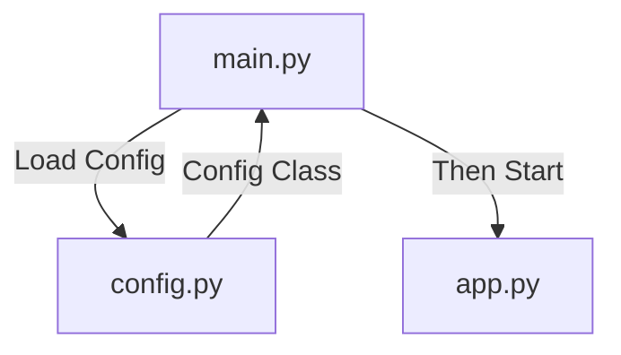

# Booting Sequence


# main.py
For loguru, see [loguru doc](https://loguru.readthedocs.io/en/stable/index.html)

# config.py
Pydantic is used to validate the yaml config, see [here](https://docs.pydantic.dev/latest/)

[Pyyaml](https://pyyaml.org/wiki/PyYAMLDocumentation) reads a file and returns a dict{}
Pydantic will automatically convert that dict into the class defined in `config.py` and validate

When fetching the config files, just do as `main.py`:
```python
from src import config
app_conf = config.AppConfig.load_config("example/config.yaml")
logger.add(sys.stderr, level=app_conf.log.level)
```

> So that the classes defined in `config.py` is like a template

