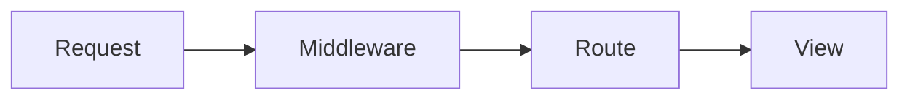

# Overview
The frontend is considered an SPA

## Django & Frontend
The Vue.js project will be compiled `npm run build` to a set of vanilla html files
```
- index.html
- xxx.css
- xxx.js
```

The `view.py` hosts the index.html file  
Django also exposes a set of apis (at `/api/*`) for the frontend to use  
There is also another middleware built upon django to process login redirect

> See [API Docs](API.md)

## Middleware


## Login
Use Django's Abstract User Model
> We don't do register here as it is a CAS system  
> See more at [UoM CAS Demo](https://studentnet.cs.manchester.ac.uk/authenticate/demonstration.php)


